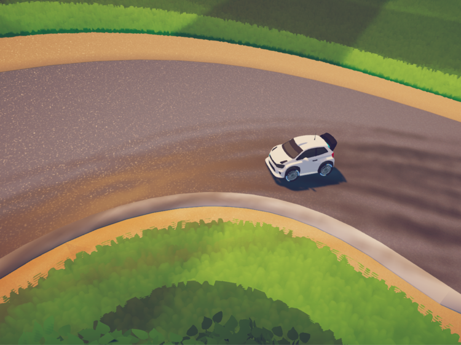
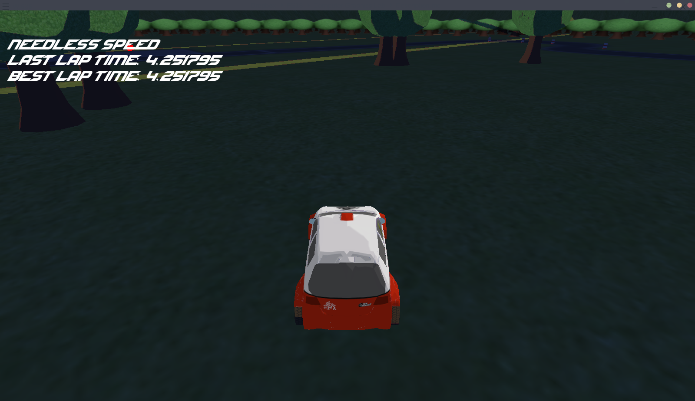

# Needless Speed - Description

## Implementation goal

The initial goal of the project was to implement a top-down racing game with the game 'Apex Racing league' as a style guideline. 

As the project went further, we tried out multiple camera settings and came to the conclusion, that a more '3rd person'-ish camera angle works better for our game setting. The environment of the game is defined by a cartoonish look, which we achieved by implementing toon shaders for our assets. For the race track, we aimed for an environment with a lot of green and nature, contrasting the asphalt of the track. All of the 3D models and assets have been painstakingly hand-crafted by ourselves to fit our needs. Some additional graphical features we wanted to implement are:

* Day & Night cycle

* Shadows

* Screen space ambient occlusion

* Volumetric frong lights

* Particles

* Wheel-turning animation

## Gameplay

The player is the only moving entity in the game as the car. The goal of the game is to achieve a good lap time and to beat one's own best time when a lap time has been set. Thus we implemented a lap timer and a best lap indicator. Sadly we had a lot of problems with displaying fonts using Opengl ES 3.0, which is why we sadly couldn't have the timer displayed in the finished product on the iPad. We the provided screenshots from a pc environment, where the working timer can be seen. The environment is populated by trees and other objects, with all of which the player may collide. There are two different types of collisions, one of which makes the player to lose the current game and triggers a 'lost' game state, while the other simulates a physical collision, bouncing the player backwards. The game has three states: A starting screen, the game itself & a crash screen.

## Graphical Features & Techniques

A particle system that follows the car has been implemented. The particle system spawns particles (which are rendered as small quads) based on the cars current speed and position, which all have an individual lifecycle. 

## Problems

The main issue we had was with the shadows. They took up a huge amount of development time and we where not able to finish them in time. The approach we took was shadow mapping from the lights point of view. The shaders for this are implemented and the shadows have been included in the game at some point, but there were some problems we could not figure out. For one, the produced shadow map had a really low accuracy, indipendent on from where it has been rendered. Additionally it was really hard debug it in any way. The only possibility we found was the intel graphics frame analyzer tool, which more often than not crashed our application right away. Also the draw() implementation of the bRenderer had to be rewritten since it did not allow to pass a shader to use, other than the shader defined when an object was instanciated. This obviously interferes with the implementation of shadow-mapping, since we need a depth shader that renders to the depth map. 

Another problem we faced was the fonts, as mentioned above. In order to appropriately use our shader code with the colorLUT, we used opengl ES 3.0, with which the exact example font code from the cave demo did not work and we sadly could not find any solutions. This meant that we had to choose between having our day & night cycle system working in the final version on the iPad, or the fonts. This is why the text (as seen in the screenshot above) is not included in the iOS application. 
